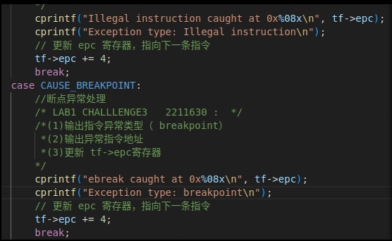

# Lab 0.5: 练习 1

通过 `x/10i $pc` 指令，可以查看当前 PC 的后面十条指令的内容，发现从 `0x1000` 处开始，执行了一系列的复位（初始化）操作，主要功能有：

1. **初始化寄存器**：
   - 设置一些必要的寄存器状态，例如栈指针（sp）和全局指针（gp），以及一些通用寄存器的值。通过 `info register` 指令，可以查看当前寄存器的值，所有寄存器都被初始化为 0。

2. **配置中断**：
   - 准备中断控制器，设置中断向量等。

3. **调用 Bootloader**：
   - 通常，这段代码会初始化硬件后，跳转到 Bootloader 的入口点（如 `0x80000000`）以加载内核。

4. **设置内存**：
   - 可能会进行内存的基本检查和设置，确保运行环境正常。

在复位结束后，跳转到了 `0x80000000` 处。可以通过 `x/10i 0x80000000` 指令查看 `0x80000000` 地址的后十条指令的内容。从这里的代码开始，是 Bootloader（本次实验的固件是 OpenSBI）内容，主要功能有：

1. **初始化硬件和设置环境**：
   - 执行一些指令以获取处理器的状态信息（如 hart ID），并配置必要的硬件资源。

2. **加载内核镜像**：
   - 从存储设备（如闪存或其他存储介质）读取内核镜像，并将其加载到内存中的 `0x80200000` 地址。

3. **地址计算和数据准备**：
   - 通过地址计算（如 `auipc` 和 `addi`）确定内存位置，确保内核镜像能够正确地放置在预定位置。

4. **验证和条件跳转**：
   - 在加载内核前，执行一些验证操作，确保所有条件都满足，然后决定是否继续加载或跳转到特定的执行路径。

5. **跳转到内核入口点**：
   - 最终，通过跳转指令（`jr`）转移控制权到内核的入口点（`0x80200000`），以开始执行内核。

---

# Lab 1

## 练习 1：理解内核启动中的程序入口操作

指令 `la sp, bootstacktop` 将栈指针 (sp) 设置为 `bootstacktop` 的地址，目的是为内核提供一个空闲的栈空间，以便后续的函数调用和局部变量存储。这是内核启动流程中重要的一步，因为它确保了内核在执行时有适当的栈可用。

而 `tail kern_init` 则是一个优化指令，它调用 `kern_init` 函数，并且通过不保存返回地址的方式来消除函数调用后的栈帧。这意味着在 `kern_init` 执行完成后，不会再返回到 `kern_entry`，而是直接在 `kern_init` 中继续执行，简化了流程并减少了栈的使用。此指令的目的是确保内核初始化过程的流畅执行。

## 练习 2：完善中断处理 （需要编程）
在`trap.c`添加代码部分：

执行结果如下：

### 扩展练习 Challenge 1：描述与理解中断流程

**流程**：

1. 中断产生（自动保存当前的执行状态）。
2. 进入中断处理程序（进入 `__alltraps`，此处调用 `SAVE_ALL` 宏保存当前的寄存器状态）。
3. 保存栈指针（`mov a0, sp` 的目的是将当前的栈指针保存到 `a0` 中，以便在后续处理中使用）。
4. 调用中断处理函数（通过 `jal trap` 跳转到中断处理的具体实现。在 `trap` 函数中，根据中断的类型进行相应的处理）。
5. 返回处理（处理完成后，控制返回到 `__trapret`，执行 `RESTORE_ALL` 恢复之前保存的寄存器状态）。
6. 恢复状态（最后，通过 `sret` 返回到中断前的执行状态）。

寄存器保存的位置是通过在栈上分配的固定偏移量来确定的。这里使用 `REGBYTES` 计算每个寄存器在栈中的存储位置，确保每个寄存器按顺序保存，以便在恢复时能够正确地从栈中加载。

并非所有中断都需要保存所有寄存器。在某些情况下，可能只需要保存特定的寄存器。例如，若中断处理程序不需要使用某些寄存器的值，则可以跳过这些寄存器的保存。保存所有寄存器的理由是确保在处理中断时能够完全恢复之前的执行状态，以防止对后续操作的影响。若用不到，可以不保存。

### 扩展练习 Challenge 2：理解上下文切换机制

- `csrw sscratch, sp` 的**作用**：将当前的栈指针 `sp` 写入到 `sscratch` 寄存器中。这个操作是为了在处理中断时保存栈指针的当前状态。

- **目的**：当中断处理完成后，可能会发生递归中断（即在处理中断时再次发生中断）。通过保存 `sp` 到 `sscratch`，系统可以判断中断是从用户态还是内核态产生。

- `csrrw s0, sscratch, x0` 的**作用**：通过 `csrrw` 指令，将 `sscratch` 中的值（即之前保存的 `sp`）读取到 `s0` 中，并将 `x0`（始终为 0）写入 `sscratch`，从而将 `sscratch` 清零。

- **目的**：清空 `sscratch` 的值以便在处理异常时，如果再次发生异常，能够通过 `sscratch` 的值判断异常来源，确保异常处理的逻辑正确性。

在处理完中断后，通常不需要还原这些 CSR，因为它们的值可能已经在处理中被修改。尤其是 `scause` 通常会在异常处理过程中被更新，保存和恢复它们可能会导致逻辑上的混淆或错误。尽管在 `RESTORE_ALL` 中不还原这些 CSR，但在异常处理的上下文中，保存这些信息仍然是有意义的。例如，可以用于调试或异常处理过程中的记录。保存这些状态可以帮助开发者在调试期间了解异常发生时的状态。

### 扩展练习 Challenge 3：完善异常中断
在`trap.c`的代码如下：

在`init.c`加入下面这些测试语句：

执行`make qemu`结果如下：

